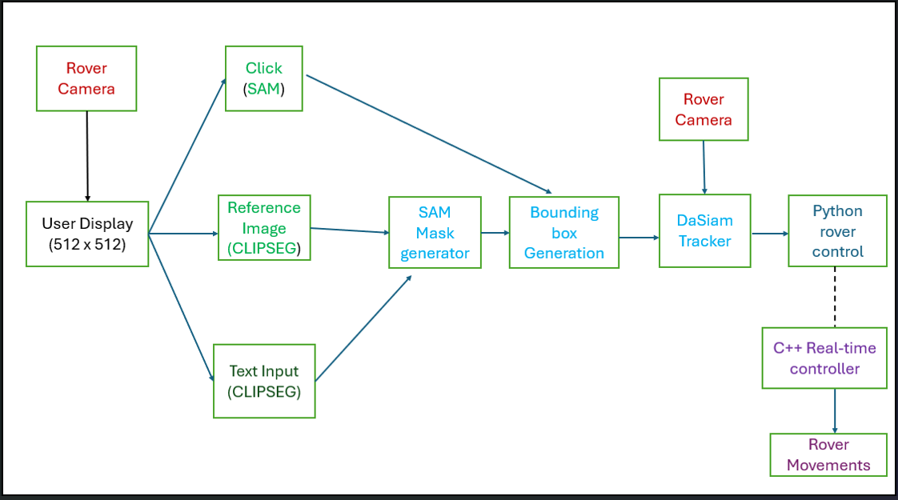
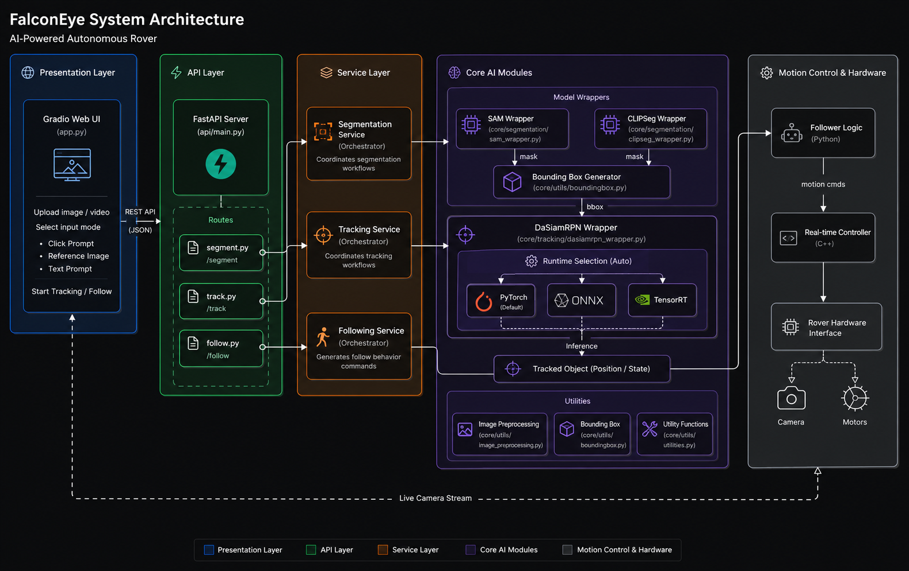
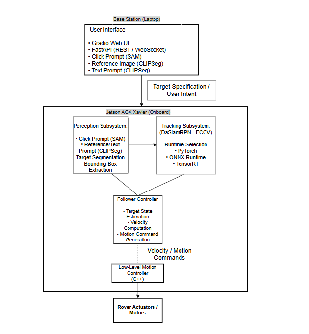

# 🚀 FalconEye

> **A Modular Prompt-Guided Perception and Tracking System for Autonomous Following**


<p align="center">
  
</p>

## What is FalconEye?

FalconEye is a real-time visual tracking and autonomous following system.
A user specifies a target — via a click, a reference image, or a text prompt —
and FalconEye segments it, tracks it across frames, and generates motion commands
to drive a rover in pursuit of that target.

It combines promptable segmentation (SAM, CLIPSeg), single-object visual tracking
(DaSiamRPN), and a C++ real-time motion controller, deployed end-to-end on
Jetson AGX Xavier hardware.

## Why FalconEye?

Traditional visual tracking systems typically require manually initializing a tracker with a bounding box and often treat perception, tracking, and robot control as separate components.

FalconEye unifies these stages into a single end-to-end pipeline. By allowing users to specify a target through intuitive prompts—such as a click, reference image, or text description—the system bridges modern vision foundation models with autonomous robotics. Its modular design enables seamless transition from research workflows to real-time edge deployment on NVIDIA Jetson hardware.

## End-to-End Pipeline

<p align="center">
    
</p>

## Features

- **Multi-modal target specification** — click prompt (SAM), reference image or
  text prompt (CLIPSeg) — no need to retrain for a new target class.

- **Real-time single-object tracking** — DaSiamRPN-based tracker maintains lock
  on the target across frames after initial segmentation.

- **Multi-backend inference** — runtime-selectable PyTorch, ONNX, or TensorRT,
  chosen per deployment target (prototyping vs edge inference).

- **Full-stack pipeline** — FastAPI backend (REST + WebSocket) with a Gradio
  web UI, service-orchestration layer, and a C++ real-time motion controller.

- **Edge-deployed** — built and profiled for Jetson AGX Xavier, not just
  desktop/cloud GPUs.

- **Autonomous following** — segmentation + tracking output feeds directly into
  velocity/motion command generation for closed-loop rover control.

## 🏗️ Software Architecture

FalconEye adopts a layered architecture to ensure modularity, extensibility, and maintainability. The system is organized into presentation, application, AI, and hardware layers, allowing each subsystem to evolve independently while communicating through well-defined interfaces.

This design enables interchangeable perception models, multiple runtime backends (PyTorch, ONNX Runtime, TensorRT), and seamless deployment across desktop and edge hardware without modifying the higher-level application logic.

<p align="center">
    
</p>

## System Deployment Architecture

<p align="center">
    
</p>

## Key Engineering Decisions

**Dependency injection for model wrappers**
CLIPSeg's wrapper takes a `SAMWrapper` instance via dependency injection rather than
loading its own copy — avoids duplicate GPU memory allocation when both models are
active in the same session.

**Singleton tracker instance**
A single global DaSiamRPN tracker instance is maintained per session instead of
re-instantiating per frame. The ONNX-exported model bakes the template branch as a
constant at export time (`do_constant_folding=True`), so template re-computation is
avoided on every tracking step.

**Runtime backend selection (PyTorch → ONNX → TensorRT)**
Inference runtime is selectable rather than hardcoded, so the same codebase runs in
PyTorch for fast iteration during development and switches to TensorRT for deployment
on Jetson AGX Xavier, where inference latency directly bottlenecks tracking framerate.

**Layered service orchestration**
Segmentation, tracking, and following are each handled by a dedicated orchestrator
service rather than a single monolithic handler — keeps the API layer thin and makes
each pipeline stage independently testable.

**Separation of Python decision logic and C++ motion control**
High-level target state estimation and velocity computation run in Python, while the
real-time motion controller is implemented in C++ — keeping hard real-time control
loops out of the Python GIL's way.

## 📂 Repository Structure

```text
FalconEye/
├── api/                     # FastAPI application
│   ├── main.py
│   └── routes/              # REST API endpoints
│       ├── segment.py
│       ├── track.py
│       └── follow.py
│
├── assets/                  # README assets
│   ├── demo.gif
│   ├── pipeline.png
│   ├── architecture.png
│   └── block.png
│
├── core/                    # Core AI modules
│   ├── segmentation/         # SAM & CLIPSeg wrappers
│   ├── tracking/             # DaSiamRPN wrapper
│   ├── following/            # Rover controller
│   └── utils/                # Shared utilities
│
├── services/                # Business logic orchestration
│   ├── segmentation_service.py
│   ├── tracking_service.py
│   └── following_service.py
│
├── scripts/                  # Setup scripts
│   ├── install.sh
│   └── download_ckpt.sh
│
├── weights/                 # Model checkpoints
│
├── app.py                   # Gradio interface
├── Dockerfile
├── requirements.txt
├── README.md
└── LICENSE
```

The repository follows a modular architecture that separates the presentation layer, API layer, AI inference pipeline, and motion control components. This organization enables individual perception models, tracking algorithms, and deployment backends to be developed and extended independently.


## How to Run

### 1. Download the model checkpoints

Run the checkpoint download script:

```bash
bash script/download_ckpt.sh
```

### 2. Install the dependencies

Run the installation script:

```bash
bash script/install.sh
```

> **Note:** Before running the installation script, update it with the appropriate PyTorch wheel for your platform (e.g., Jetson, CUDA version, or CPU-only environment).

### 3. Launch the application

#### Gradio Interface

```bash
python app.py
```

The Gradio interface provides three target specification modes:

- 🖱️ Click Prompt
- 🖼️ Reference Image
- 💬 Text Prompt

---

#### FastAPI Server

```bash
uvicorn api.main:app --host 0.0.0.0 --port 8080
```

Development Notes:

Run the FastAPI server without --reload for normal usage.
If you need auto-reload during development, use the watchfiles reloader.
When using watchfiles, configure it to ignore large model files (such as *.onnx) to avoid unnecessary reloads as it is reset the tracker giving you errors.

---

## 🌐 REST API

| Endpoint | Method | Description |
|----------|--------|-------------|
| `/segment` | POST | Segment target using click, reference image, or text prompt |
| `/track` | POST | Initialize or update object tracking |
| `/follow` | POST | Generate rover motion commands |

## ⚡ Runtime Backends

FalconEye supports multiple inference runtimes through a unified abstraction layer.

| Backend | Purpose |
|---------|---------|
| PyTorch | Development and debugging |
| ONNX Runtime | Portable accelerated inference |
| TensorRT | Optimized deployment on NVIDIA Jetson |

## 🛣️ Roadmap

- [x] Click Prompt Tracking
- [x] Reference Image Tracking
- [x] Text Prompt Tracking
- [x] FastAPI Integration
- [x] TensorRT Backend


## 🙏 Acknowledgements

FalconEye builds upon several outstanding open-source projects and research contributions. We gratefully acknowledge the authors and maintainers of:

- **Segment Anything (SAM)** — Meta AI, for foundation-model-based image segmentation.
- **CLIPSeg** — for text- and reference-image-guided segmentation.
- **DaSiamRPN** — for robust distractor-aware Siamese object tracking.
- **PyTorch** — for deep learning development and model execution.
- **FastAPI** — for the REST API framework.
- **Gradio** — for the interactive web interface.
- **ONNX Runtime** — for portable, hardware-accelerated inference.
- **NVIDIA TensorRT** — for optimized edge inference on Jetson platforms.

Thanks to the open-source ML/CV community whose tooling made a solo, full-stack
build like this feasible in a reasonable timeframe.

## 📚 Citation

If you find FalconEye useful in your research or applications, please consider citing our work.

```bibtex
@misc{falconeye2026,
  title        = {FalconEye: A Modular Prompt-Guided Perception and Tracking System for Autonomous Following},
  author       = {Varun Sai},
  year         = {2026},
  note         = {GitHub repository. Paper coming soon.},
  howpublished = {\url{https://github.com/Varun-Sai-500/FalconEye}}
}
```