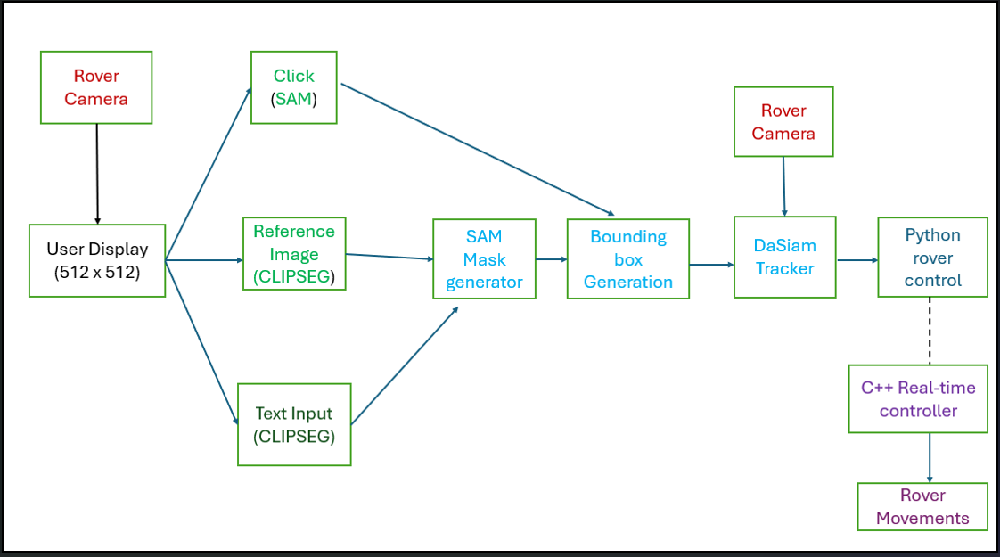
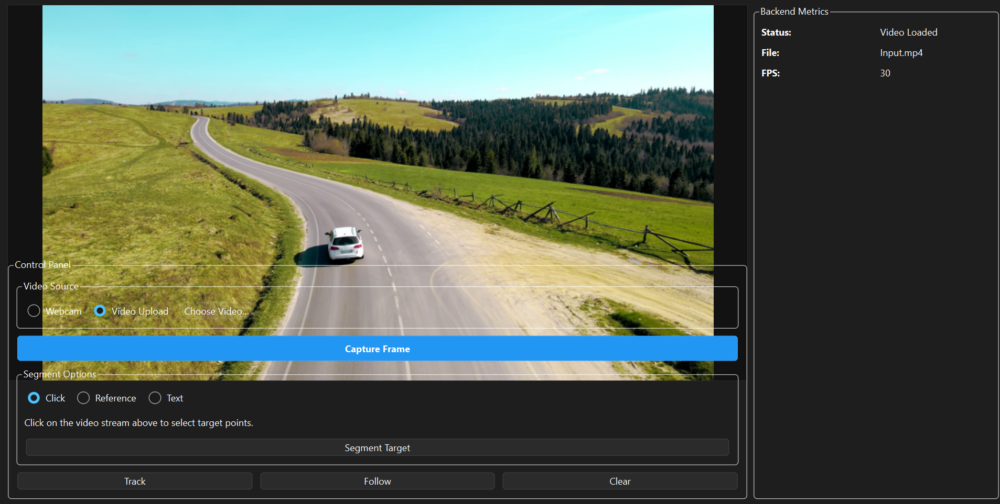
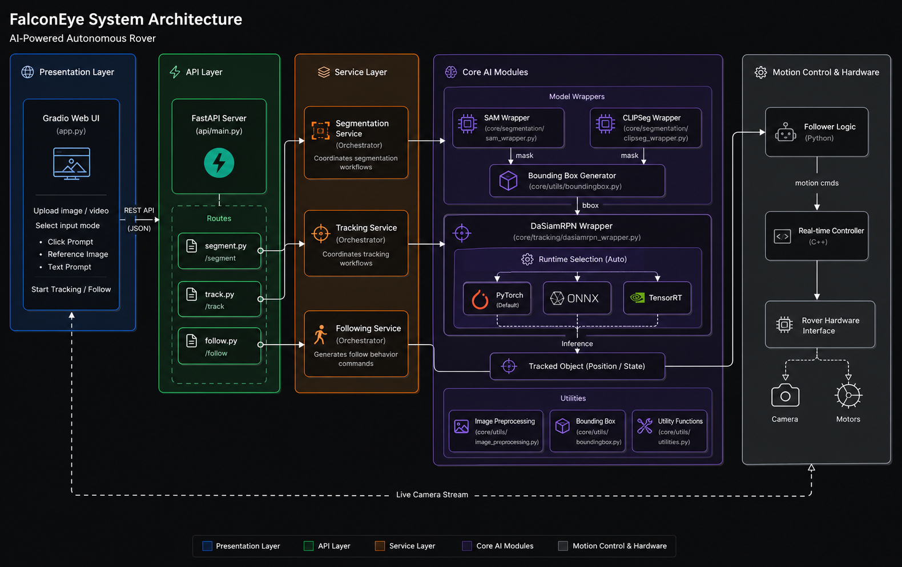
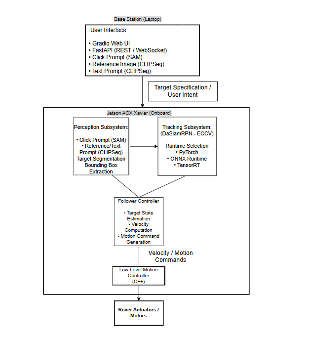

# 🚀 FalconEye

> **A Modular Prompt-Guided Perception and Tracking System for Autonomous Following**


## 📑 Table of Contents

- [What is FalconEye?](#what-is-falconeye)
- [Why FalconEye?](#why-falconeye)
- [End-to-End Pipeline](#end-to-end-pipeline)
- [Features](#features)
- [Software Architecture](#️-software-architecture)
- [System Deployment Architecture](#system-deployment-architecture)
- [Key Engineering Decisions](#key-engineering-decisions)
- [Repository Structure](#-repository-structure)
- [Getting Started](#getting-started)
- [Docker](#-docker)
- [REST API](#-rest-api)
- [Runtime Backends](#-runtime-backends)
- [Roadmap](#-roadmap)
- [Acknowledgements](#-acknowledgements)
- [Citation](#-citation)
- [License](#-license)


## What is FalconEye?

FalconEye is a real-time visual tracking and autonomous following system.
A user specifies a target — via a click, a reference image, or a text prompt —
and FalconEye segments it, tracks it across frames, and generates motion commands
to drive a rover in pursuit of that target.

It combines promptable segmentation (SAM, CLIPSeg), single-object visual tracking
(DaSiamRPN), and a C++ real-time motion controller, deployed end-to-end on
Jetson AGX Xavier hardware.

## Why FalconEye?

Traditional visual tracking systems typically require manually initializing a tracker with a bounding box and often treat perception, tracking, and robot control as separate components.

FalconEye unifies these stages into a single end-to-end pipeline. By allowing users to specify a target through intuitive prompts—such as a click, reference image, or text description—the system bridges modern vision foundation models with autonomous robotics. Its modular design enables seamless transition from research workflows to real-time edge deployment on NVIDIA Jetson hardware.

## Performance

| Backend | Precision | Pure Inference FPS | End-to-End FPS | Mean Latency | P95 Latency | P99 Latency | Failure Rate |
|---|---|---:|---:|---:|---:|---:|---:|
| **TensorRT** | FP16 | **3,843.32** | **405.75** | **2.46 ms** | **3.76 ms** | **11.23 ms** | **0.00%** |
| ONNX | FP16 | 1,556.72 | 299.66 | 3.34 ms | 9.49 ms | 17.58 ms | 0.00% |
| PyTorch | FP16 | 1,469.50 | 291.82 | 3.43 ms | 5.58 ms | 19.53 ms | 0.00% |

## End-to-End Pipeline

<p align="center">
    
</p>

## Features

<p align="center">
  
</p>

- **Multi-modal target specification** — click prompt (SAM), reference image or
  text prompt (CLIPSeg) — no need to retrain for a new target class.

- **Real-time single-object tracking** — DaSiamRPN-based tracker maintains lock
  on the target across frames after initial segmentation.

- **Multi-backend inference** — runtime-selectable PyTorch, ONNX, or TensorRT,
  chosen per deployment target (prototyping vs edge inference).

- **Full-stack pipeline** — FastAPI backend (REST + WebSocket) with a Gradio
  web UI, service-orchestration layer, and a C++ real-time motion controller.

- **Edge-deployed** — built and profiled for Jetson AGX Xavier, not just
  desktop/cloud GPUs.

- **Autonomous following** — segmentation + tracking output feeds directly into
  velocity/motion command generation for closed-loop rover control.

## 🏗️ Software Architecture

FalconEye adopts a layered architecture to ensure modularity, extensibility, and maintainability. The system is organized into presentation, application, AI, and hardware layers, allowing each subsystem to evolve independently while communicating through well-defined interfaces.

This design enables interchangeable perception models, multiple runtime backends (PyTorch, ONNX Runtime, TensorRT), and seamless deployment across desktop and edge hardware without modifying the higher-level application logic.

<p align="center">
    
</p>

## System Deployment Architecture

<p align="center">
    
</p>

## Key Engineering Decisions

**Dependency injection for model wrappers**
CLIPSeg's wrapper takes a `SAMWrapper` instance via dependency injection rather than
loading its own copy — avoids duplicate GPU memory allocation when both models are
active in the same session.

**Singleton tracker instance**
A single global DaSiamRPN tracker instance is maintained per session instead of
re-instantiating per frame. The ONNX-exported model bakes the template branch as a
constant at export time (`do_constant_folding=True`), so template re-computation is
avoided on every tracking step.

**Runtime backend selection (PyTorch → ONNX → TensorRT)**
Inference runtime is selectable rather than hardcoded, so the same codebase runs in
PyTorch for fast iteration during development and switches to TensorRT for deployment
on Jetson AGX Xavier, where inference latency directly bottlenecks tracking framerate.

**Layered service orchestration**
Segmentation, tracking, and following are each handled by a dedicated orchestrator
service rather than a single monolithic handler — keeps the API layer thin and makes
each pipeline stage independently testable.

**Separation of Python decision logic and C++ motion control**
High-level target state estimation and velocity computation run in Python, while the
real-time motion controller is implemented in C++ — keeping hard real-time control
loops out of the Python GIL's way.

## 📂 Repository Structure

```text
FalconEye/
├── api/                     # FastAPI application
│   ├── main.py
│   └── routes/              # REST API endpoints
│       ├── segment.py
│       ├── track.py
│       └── follow.py
│
├── assets/                  # README assets
│   ├── architecture.png
│   ├── block.png
|   ├──frontend.jpg
|   └──pipeline.png
│
├── core/                    # Core AI modules
│   ├── segmentation/         # SAM & CLIPSeg wrappers
│   ├── tracking/             # DaSiamRPN wrapper
│   ├── following/            # Rover controller
│   └── utils/                # Shared utilities
│
├── services/                # Business logic orchestration
│   ├── segmentation_service.py
│   ├── tracking_service.py
│   └── following_service.py
│
├── app.py                   # PySide6 interface
├── Dockerfile
├── docker-compose.ghcr.yml  # for deployment
├── docker-compose.yml       # for end users to build/develop
├── requirements.txt
├── README.md
└── LICENSE
```

The repository follows a modular architecture that separates the presentation layer, API layer, AI inference pipeline, and motion control components. This organization enables individual perception models, tracking algorithms, and deployment backends to be developed and extended independently.


# Getting Started

FalconEye supports two deployment paths:

| Hardware | Recommended Deployment |
| :--- | :--- |
| **CPU** | Native Python installation |
| **NVIDIA GPU** | Docker with the prebuilt GHCR image |

> **Note:** The prebuilt Docker image is FalconEye's canonical GPU deployment. GPU users should not install FalconEye's Python dependencies manually.

---

## 1. CPU Installation

### Step 1: Create and activate a virtual environment

```bash
python -m venv venv
```

* **Linux / macOS:**
  ```bash
  source venv/bin/activate
  ```
* **Windows (PowerShell):**
  ```powershell
  .\venv\Scripts\Activate.ps1
  ```
* **Windows (Command Prompt):**
  ```cmd
  venv\Scripts\activate.bat
  ```

### Step 2: Upgrade pip

```bash
python -m pip install --upgrade pip
```

### Step 3: Install the dependencies

```bash
python -m pip install -r requirements.txt
```

> **Important:** The provided `requirements.txt` contains GPU-oriented dependencies. CPU users should replace or remove GPU-specific packages such as `onnxruntime-gpu` and `tensorrt`, and install the appropriate CPU build of PyTorch, TorchVision, and TorchAudio for their platform.  
> For PyTorch installation instructions, see the official [PyTorch installation guide](https://pytorch.org/get-started/locally/).

---

## 2. GPU Installation — Docker

Docker is the canonical GPU deployment method for FalconEye.

FalconEye provides a prebuilt GPU image through GitHub Container Registry (GHCR). The image includes the complete FalconEye runtime, including:

- PyTorch
- TensorRT
- ONNX Runtime GPU
- FastAPI
- PySide6
- FalconEye modules
- Model weights

### Pull and Run the Prebuilt Image

GPU users can pull and start the prebuilt image directly:

```bash
docker compose -f docker-compose.ghcr.yml up
```

Docker Compose will pull the image from GHCR automatically if it is not already available locally.

### Build from Source

For development or when modifying the Docker image, you can build it locally:

```bash
docker compose up --build
```

---

## Running FalconEye

### Native CPU Installation

* **Qt (PySide6) Interface:**
  ```bash
  python app.py
  ```
* **FastAPI Server:**
  ```bash
  uvicorn api.main:app --host 0.0.0.0 --port 8080
  ```

### Docker GPU Installation

The Docker Compose configuration starts FalconEye using the containerized application stack.

After startup:

| Service | URL |
| :--- | :--- |
| **FastAPI API** | `http://localhost:8080` |
| **Swagger Docs** | `http://localhost:8080/docs` |

To stop the containers:

```bash
docker compose down
```

## 🌐 REST API

| Endpoint | Method | Description |
|----------|--------|-------------|
| `/segment` | POST | Segment target using click, reference image, or text prompt |
| `/track` | POST | Initialize or update object tracking |
| `/follow` | POST | Generate rover motion commands |

## ⚡ Runtime Backends

FalconEye supports multiple inference runtimes through a unified abstraction layer.

| Backend | Purpose |
|---------|---------|
| PyTorch | Development and debugging |
| ONNX Runtime | Portable accelerated inference |
| TensorRT | Optimized deployment on NVIDIA Jetson |

## 🛣️ Roadmap

- [x] FastAPI & Gradio Integration
- [x] ONNXRuntime Backend
- [x] TensorRT Backend
- [x] Separation of backend manager with tracking wrapper
- [x] Single Synchronization point for tracker

- [ ] GStreamer integration
- [ ] Future Re-Identification case - SAM usage when confidence drops
- [ ] Improve Tracker - use dasiamrpn's outputs

## 🙏 Acknowledgements

FalconEye builds upon several outstanding open-source projects and research contributions. We gratefully acknowledge the authors and maintainers of:

- **Segment Anything (SAM)** — Meta AI, for foundation-model-based image segmentation.
- **CLIPSeg** — for text- and reference-image-guided segmentation.
- **DaSiamRPN** — for robust distractor-aware Siamese object tracking.
- **PyTorch** — for deep learning development and model execution.
- **FastAPI** — for the REST API framework.
- **Gradio** — for the interactive web interface.
- **ONNX Runtime** — for portable, hardware-accelerated inference.
- **NVIDIA TensorRT** — for optimized edge inference on Jetson platforms.

Thanks to the open-source ML/CV community whose tooling made a solo, full-stack
build like this feasible in a reasonable timeframe.

## 📚 Citation

If you find FalconEye useful in your research or applications, please consider citing our work.

```bibtex
@misc{varunsai_falconeye_2026,
  author       = {Varun Sai},
  title        = {FalconEye: A Modular Prompt-Guided Perception and Tracking System for Autonomous Following},
  year         = {2026},
  howpublished = {\url{https://github.com/Varun-Sai-500/FalconEye}},
  note         = {GitHub repository}
}
```
## 📄 License

This project is licensed under the **Apache License 2.0**.

You are free to use, modify, and distribute this software in accordance with the terms of the license. See the [LICENSE](LICENSE) file for the full license text.